# SpendSense — Smart Expense Tracker App  

<p align="center">
  
</p>

A modern Flutter-based money management application built with **Supabase**, **Flutter**, and **Material Design 3**.  
SpendSense membantu pengguna mencatat pemasukan, pengeluaran, dan transfer antar akun secara cepat, aman, dan intuitif.

---

## 📋 Getting Started

### 1️⃣ **Prerequisites**

Pastikan komputer Anda telah menginstal software berikut:

- **Git** → https://git-scm.com/downloads  
- **VS Code** → https://code.visualstudio.com  
- **Flutter SDK** → https://docs.flutter.dev/get-started/install  
- Pastikan `flutter doctor` centang hijau semua ✅
- **Android Studio** (untuk emulator Android)
- **Xcode** (untuk iOS - hanya macOS)

### 2️⃣ **Clone Repository**

```bash
git clone https://github.com/aryabimasantoso21/spendsense.git
cd spendsense
```

### 3️⃣ **Install Flutter Dependencies**

```bash
flutter pub get
```

### 4️⃣ **Setup Backend (Supabase)**

#### **Step 1: Buat Project Supabase**
1. Buka https://supabase.com  
2. Login / Sign Up dengan akun Google atau Email  
3. Klik tombol **New Project**  
4. Masukkan nama project: **SpendSense**  
5. Buat password database yang kuat  
6. Pilih region terdekat (contoh: Singapore)
7. Klik **Create Project**  
8. Tunggu hingga status menjadi hijau/aktif (~2-3 menit)

#### **Step 2: Create Table Database**

1. Di dashboard Supabase, buka menu **SQL Editor**
2. Copy dan paste SQL query di bawah ini → klik **Run**:

```sql
-- RESET TABEL (jalankan ini jika ada tabel lama)
DROP TABLE IF EXISTS transactions CASCADE;
DROP TABLE IF EXISTS accounts CASCADE;
DROP TABLE IF EXISTS categories CASCADE;
DROP TABLE IF EXISTS users CASCADE;

-- USERS TABLE
CREATE TABLE users (
  user_id SERIAL PRIMARY KEY,
  username VARCHAR(255),
  email TEXT UNIQUE NOT NULL,
  password TEXT,
  total_balance DOUBLE PRECISION DEFAULT 0,
  created_at TIMESTAMP WITH TIME ZONE DEFAULT NOW()
);

-- CATEGORIES TABLE
CREATE TABLE categories (
  category_id SERIAL PRIMARY KEY,
  type VARCHAR(50) NOT NULL,
  name VARCHAR(100) NOT NULL
);

-- ACCOUNTS TABLE
CREATE TABLE accounts (
  account_id SERIAL PRIMARY KEY,
  user_id INTEGER REFERENCES users(user_id) ON DELETE CASCADE,
  account_name VARCHAR(100) NOT NULL,
  account_type VARCHAR(50) NOT NULL,
  balance DOUBLE PRECISION DEFAULT 0,
  created_at TIMESTAMP WITH TIME ZONE DEFAULT NOW()
);

-- TRANSACTIONS TABLE
CREATE TABLE transactions (
  transaction_id SERIAL PRIMARY KEY,
  user_id INTEGER REFERENCES users(user_id) ON DELETE CASCADE,
  account_id INTEGER REFERENCES accounts(account_id) ON DELETE CASCADE,
  destination_account_id INTEGER REFERENCES accounts(account_id) ON DELETE SET NULL,
  category_id INTEGER REFERENCES categories(category_id) ON DELETE SET NULL,
  type VARCHAR(50) NOT NULL,
  amount DOUBLE PRECISION NOT NULL,
  description VARCHAR(255),
  date TIMESTAMP WITH TIME ZONE DEFAULT NOW(),
  created_at TIMESTAMP WITH TIME ZONE DEFAULT NOW()
);

-- SEED DEFAULT CATEGORIES
INSERT INTO categories (type, name) VALUES
('income', 'Gaji'),
('income', 'Hadiah'),
('income', 'Investasi'),
('expense', 'Makanan & Minuman'),
('expense', 'Transportasi'),
('expense', 'Belanja'),
('expense', 'Tagihan'),
('expense', 'Hiburan'),
('expense', 'Kesehatan'),
('expense', 'Pendidikan');
```

#### **Step 3: Dapatkan Supabase Credentials**
1. Di dashboard Supabase, buka menu **Settings** → **API**
2. Copy **Project URL** dan **anon key**
3. Buka file `lib/data/services/supabase_service.dart` di VS Code
4. Cari dan ganti variable:
   ```dart
    Future<void> init() async {
        await Supabase.initialize(
            url: 'YOUR_PROJECT_URL',
            anonKey: 'YOUR_ANON_KEY',
    );
    
   ```
   Ganti dengan URL dan key dari Supabase Anda

#### **Step 4: Enable Authentication**
1. Di dashboard Supabase, buka menu **Authentication** → **Providers**
2. Cari provider **Email** dan pastikan toggle aktif (warna biru)
3. Konfigurasi email templates jika diperlukan

---

## 🚀 Run SpendSense

### **🤖 Android (Emulator atau Device)**

#### **Opsi 1: Menggunakan Android Emulator**

```bash
# Lihat emulator yang tersedia
flutter emulators

# Buka emulator tertentu (ganti <nama> dengan nama emulator)
flutter emulators --launch <nama>

# Jalankan aplikasi
flutter run
```

#### **Opsi 2: Menggunakan Device Android Fisik**

```bash
# Aktifkan USB Debugging di device Android
# Settings → About → Tekan Build Number 7x → Developer Options → USB Debugging

# Hubungkan device via USB
# Cek device yang terdeteksi
flutter devices

# Jalankan aplikasi
flutter run
```

#### **Mode Release (Produksi)**
```bash
flutter run --release
```

---

### **🍎 Untuk iOS (macOS only)**

#### **Step 1: Setup iOS Dependencies**
```bash
cd ios
pod install
cd ..
```

#### **Step 2: Buka Simulator iOS**
```bash
open -a Simulator
```

#### **Step 3: Jalankan Aplikasi**
```bash
flutter run
```

---

### **🌐 Untuk Web**

```bash
flutter run -d chrome
```

Atau:
```bash
flutter run -d firefox
```

---

### **🪟 Untuk Windows**

```bash
flutter run -d windows
```

---

## 🎯 Deskripsi Proyek

**SpendSense** adalah aplikasi manajemen keuangan pribadi yang dirancang untuk memudahkan pengguna dalam:

- 💰 **Mencatat Transaksi** - Mencatat pemasukan (income), pengeluaran (expense), dan transfer antar akun
- 🏦 **Mengelola Akun** - Membuat dan mengelola berbagai akun (Bank, Cash, E-Wallet)
- 📊 **Visualisasi Data** - Melihat statistik pengeluaran dan pemasukan dalam bentuk chart/grafik
- 🔐 **Keamanan Data** - Setiap user hanya bisa melihat data miliknya sendiri
- 🌐 **Multi-Platform** - Tersedia untuk Android, iOS, Web, Windows, dan Linux

### 🚀 Fitur Utama

#### **Manajemen Pengguna**
- ✅ Registrasi & Login dengan Email
- ✅ Penyimpanan total balance per user
- ✅ Isolasi data: setiap user hanya melihat datanya sendiri

#### **Manajemen Akun**
- ✅ Tambah akun (Bank / Cash / E-Wallet)
- ✅ Penyimpanan saldo untuk masing-masing akun
- ✅ Transfer uang antar akun

#### **Manajemen Transaksi**
- ✅ Pencatatan **Income**, **Expense**, dan **Transfer**
- ✅ Pengkategorian otomatis berdasarkan jenis transaksi
- ✅ List transaksi yang terurut otomatis berdasarkan tanggal (terbaru di atas)

#### **Kategori Default**
Aplikasi memiliki kategori awal seperti:
- **Income**: Gaji, Hadiah, Investasi  
- **Expense**: Makanan & Minuman, Transportasi, Belanja, Tagihan, Hiburan, Kesehatan, Pendidikan

### 🛠️ **Tech Stack**

| Teknologi | Versi | Fungsi |
|-----------|-------|--------|
| **Flutter** | ^3.9.2 | Framework UI cross-platform |
| **Dart** | ^3.9.2 | Programming language |
| **Supabase** | ^2.10.3 | Backend & Database (PostgreSQL) |
| **Material Design 3** | - | UI Design System |
| **FL Chart** | ^0.68.0 | Data visualization library |
| **Image Picker** | ^1.2.1 | Galeri & Camera picker |
| **Shared Preferences** | ^2.2.2 | Local storage |
| **IntL** | ^0.20.2 | Internationalization |

---

## 📁 Struktur Folder

```
spendsense/
├── 📄 pubspec.yaml                # Konfigurasi project & dependencies
├── 📄 analysis_options.yaml       # Analisis code style
├── 📄 l10n.yaml                   # Konfigurasi localization
├── 📄 README.md                   # Dokumentasi project (file ini)
│
├── 📂 lib/                        # 🎯 SOURCE CODE UTAMA
│   ├── 📄 main.dart              # Entry point aplikasi
│   │
│   ├── 📂 data/                   # Data Layer
│   │   ├── 📂 models/            # Model data structure
│   │   │   ├── user_model.dart
│   │   │   ├── account_model.dart
│   │   │   ├── transaction_model.dart
│   │   │   └── category_model.dart
│   │   └── 📂 services/          # API & Database services
│   │       ├── auth_service.dart
│   │       ├── account_service.dart
│   │       └── transaction_service.dart
│   │
│   ├── 📂 pages/                  # UI Pages/Screens
│   │   ├── 📂 auth/              # Authentication pages
│   │   │   ├── login_page.dart
│   │   │   └── register_page.dart
│   │   ├── 📂 home/              # Home/Dashboard page
│   │   │   └── home_page.dart
│   │   ├── 📂 transactions/      # Transaction management
│   │   │   ├── transaction_list_page.dart
│   │   │   └── add_transaction_page.dart
│   │   ├── 📂 accounts/          # Account management
│   │   │   ├── account_list_page.dart
│   │   │   └── add_account_page.dart
│   │   └── 📂 profile/           # User profile
│   │       └── profile_page.dart
│   │
│   ├── 📂 presentation/           # Business Logic & State Management
│   │   ├── 📂 providers/         # Provider/Controller
│   │   │   ├── auth_provider.dart
│   │   │   ├── account_provider.dart
│   │   │   └── transaction_provider.dart
│   │   └── 📂 widgets/           # Reusable widgets
│   │       ├── app_button.dart
│   │       ├── app_card.dart
│   │       └── transaction_item.dart
│   │
│   ├── 📂 utils/                  # Utility & Helper Functions
│   │   ├── 📂 constants/         # Constants & enums
│   │   │   ├── app_colors.dart
│   │   │   ├── app_strings.dart
│   │   │   └── transaction_types.dart
│   │   ├── 📂 helpers/           # Helper functions
│   │   │   ├── date_helper.dart
│   │   │   ├── currency_helper.dart
│   │   │   └── validation_helper.dart
│   │   └── 📂 validators/        # Input validators
│   │       ├── email_validator.dart
│   │       └── amount_validator.dart
│   │
│   └── 📂 l10n/                   # Localization (Multi-language)
│       ├── app_en.arb           # English translations
│       ├── app_id.arb           # Indonesian translations
│       └── app_localizations_en.dart
│
├── 📂 android/                    # Android Native Code
│   ├── 📄 build.gradle.kts       # Gradle configuration
│   ├── 📂 app/
│   │   ├── build.gradle.kts
│   │   └── 📂 src/
│   │       ├── main/
│   │       ├── debug/
│   │       └── profile/
│   └── 📂 gradle/
│
├── 📂 ios/                        # iOS Native Code
│   ├── 📂 Runner/                # iOS app resources
│   ├── 📂 Runner.xcodeproj/      # Xcode project
│   └── 📂 Pods/                  # CocoaPods dependencies
│
├── 📂 web/                        # Web Platform
│   ├── 📄 index.html             # Web entry point
│   ├── 📄 manifest.json          # Web app manifest
│   └── 📂 icons/                 # Web icons
│
├── 📂 windows/                    # Windows Platform
│   ├── 📄 CMakeLists.txt
│   ├── 📂 runner/
│   └── 📂 flutter/
│
├── 📂 linux/                      # Linux Platform
│   ├── 📄 CMakeLists.txt
│   ├── 📂 runner/
│   └── 📂 flutter/
│
├── 📂 test/                       # Unit & Widget Tests
│   ├── 📄 widget_test.dart      # Contoh widget test
│   └── 📄 unit_test.dart        # Contoh unit test
│
├── 📂 build/                      # Build Output (Generated)
│   ├── 📂 app/                   # Compiled app files
│   ├── 📂 flutter_assets/        # Assets yang sudah digabung
│   └── 📂 outputs/               # APK, AAB, dll
│
└── 📂 img/                        # Assets (Gambar & Logo)
    ├── 📄 logo_withtext.png     # Logo aplikasi
    └── ...                       # Gambar lainnya
```

### **📚 Penjelasan Struktur Folder Penting:**

| Folder | Fungsi |
|--------|--------|
| `lib/data/` | Mengelola data dari Supabase, model data, dan API services |
| `lib/pages/` | UI screens/halaman aplikasi (Auth, Home, Transactions, dll) |
| `lib/presentation/` | Business logic, state management, dan reusable widgets |
| `lib/utils/` | Fungsi utility, konstanta, validators, dan helpers |
| `lib/l10n/` | File localization untuk multi-bahasa |
| `android/` & `ios/` | Konfigurasi native untuk Android dan iOS |
| `web/`, `windows/`, `linux/` | Platform-specific configurations |
| `test/` | Unit tests dan widget tests untuk testing |

---

## ⚙️ Troubleshooting

### **❌ 1. `flutter doctor` ada yang tidak centang**

**Solusi:**
```bash
flutter doctor -v
# Ikuti instruksi yang diberikan untuk fix setiap issues
```

### **❌ 2. Dependencies Conflict atau Error**

**Solusi:**
```bash
flutter pub get
flutter pub upgrade
flutter clean
flutter pub get
```

### **❌ 3. Build Cache Issue**

**Solusi:**
```bash
flutter clean
flutter pub get
flutter run
```

### **❌ 4. Android Emulator tidak mau jalan**

**Solusi:**
```bash
# Lihat emulator yang tersedia
flutter emulators

# Buka emulator dengan verbose
flutter emulators --launch <nama> -v
```

### **❌ 5. Supabase Connection Error**

**Periksa:**
- ✅ Pastikan credentials (`SUPABASE_URL` dan `SUPABASE_ANON_KEY`) sudah benar di `main.dart`
- ✅ Cek koneksi internet
- ✅ Verifikasi project Supabase sudah aktif di dashboard
- ✅ Pastikan tabel sudah dibuat di database

### **❌ 6. iOS Pod Install Error** (macOS only)

**Solusi:**
```bash
cd ios
rm -rf Pods
pod install --repo-update
cd ..
flutter clean
flutter pub get
flutter run
```

---

## 📱 Screenshot & Demo

### Light Mode
- Splash — 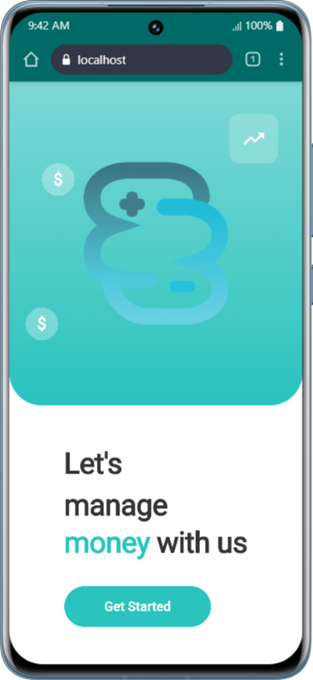
- Login — 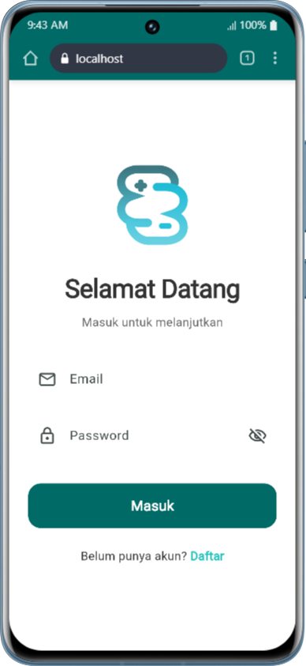
- Home — 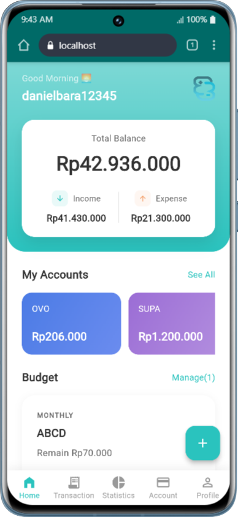
- Stats — 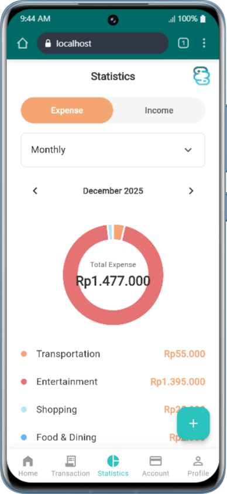
- History — 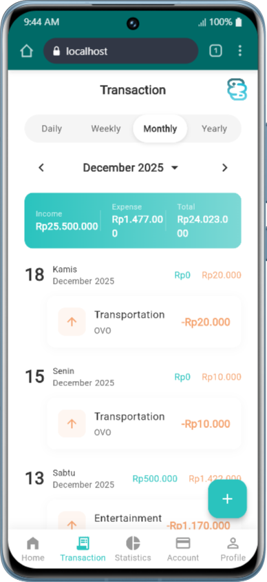
- Accounts — 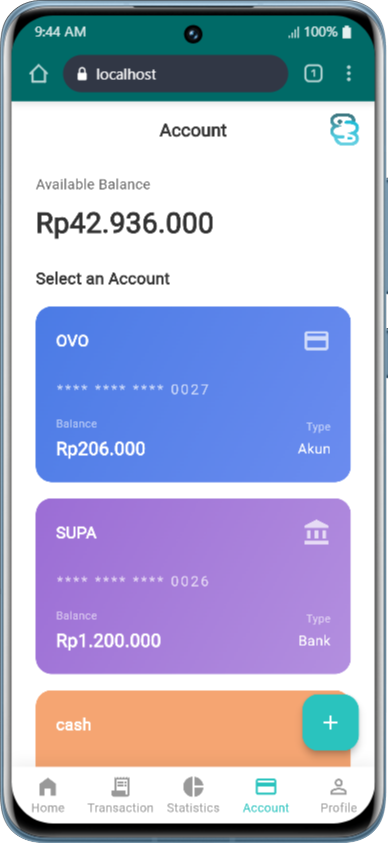
- Input — 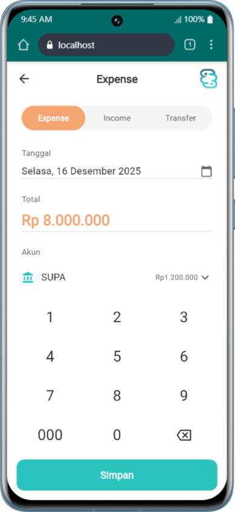
- Budget — 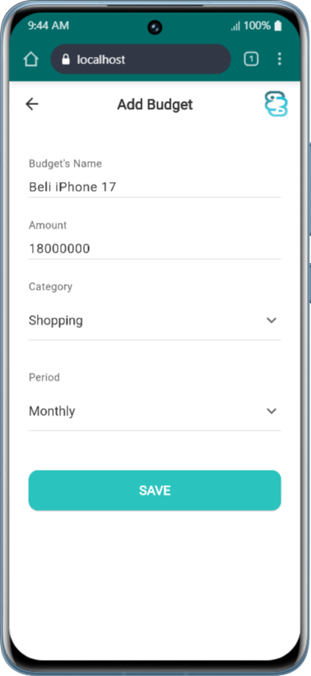
- Profile — 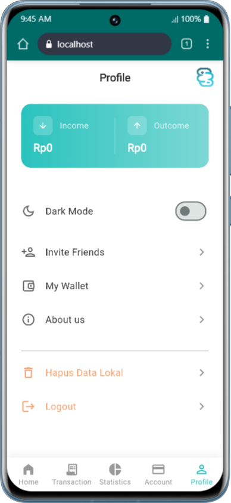

### Dark Mode
- Home — 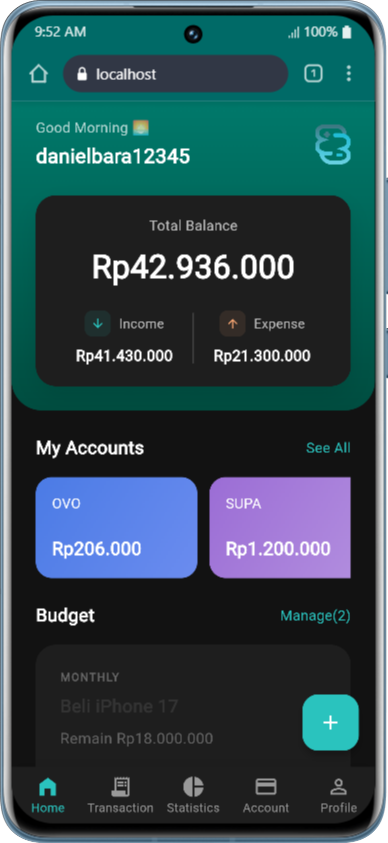
- Stats — 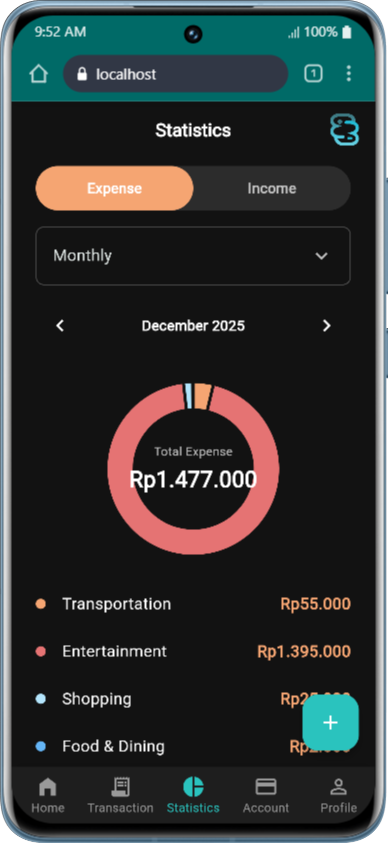
- History — 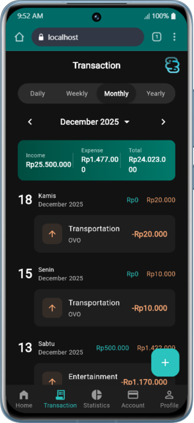
- Accounts — 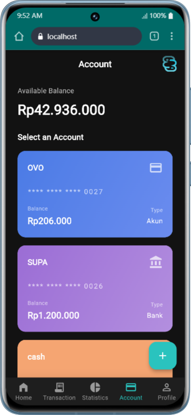
- Profile — 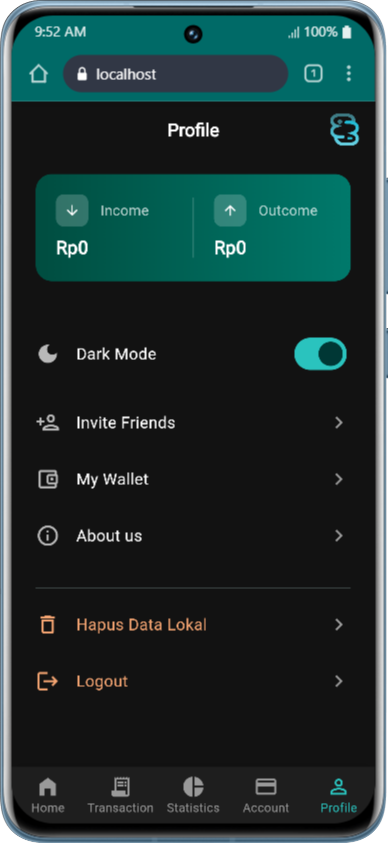

---

## 📚 Resources & Documentation

- **Flutter Documentation**: https://docs.flutter.dev
- **Supabase Documentation**: https://supabase.com/docs
- **Material Design 3**: https://m3.material.io
- **Dart Language**: https://dart.dev/guides

---

## 👥 Kontributor

- **Developer**: 
  1. Aryabima Kurnia Pratama Santoso
  2. Daniel Bara Seftino
  3. Oryza Reynaleta Wibowo
  4. Tiffany Catherine Prasetya
  5. Farrel Aditya Rosyidi
  6. Rafael Dimas Kristianto
  7. Javed Amani Syauki
- **GitHub**: https://github.com/aryabimasantoso21

---

## 📞 Contact & Support

- **Email**: 
  1. aryabimasantoso21@gmail.com
  2. farreladitya003@gmail.com
  3. dimasrafael62@gmail.com
  4. javedamani124@gmail.com
  5. anielbara12345@gmail.com
  6. tiffanycatherine08@gmail.com
  7. oryzareyyy@gmail.com
- **Repository**: https://github.com/aryabimasantoso21/spendsense
- **Issues**: https://github.com/aryabimasantoso21/spendsense/issues

---

## 📄 License

Proyek ini bersifat open-source dengan izin kontributor

---

**Last Updated**: Desember 2025
